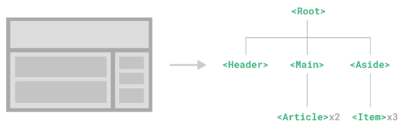
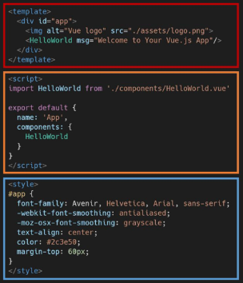

## Node.js
- 자바스크립트는 브라우저를 조작하는 유일한 언어
    - 브라우저 밖에서는 구동할 수 없음
- 자바스크립트를 구동하기 위한 런타임 환경인 Node.js로 인해 브라우저가 아닌 환경에서도 구동할 수 있게 됨
    - Chrome V8 엔진을 제공하여 여러 OS 환경에서 실행할 수 있는 환경을 제공
    - Browser만 조작 가능했으나, Server-Side-Programming 또한 가능해짐
### NPM (Node Package Manage)
- 자바스크립트 패키지 관리자
    - Python의 pip역할
    - pip와 마찬가지로 다양한 의존성 패키지를 관리
- Node.js의 기본 패키지 관리자
- Node.js 설치 시 함께 설치됨

# Vue CLI
- Vue 개발을 위한 표준 도구
- 프로젝트의 구성을 도와주는 역할
- 확장 플러그인, GUI, Babel 등 다양한 tool 제공
- 설치
```bash
$ npm install -g @vue/cli
```
- 프로젝트 생성
    - vscode terminal에서 진행
```bash
$ vue create vue-cli
```
- Vue 버전 선택 (Vue2)
- 프로젝트 디렉토리로 이동
```bash
$ cd vue-cli
```
- 프로젝트 실행
```bash
$ npm run serve
```
## Vue CLI 프로젝트 구조
### node_modules
- node.js 환경의 여러 의존성 모듈
- python의 venv와 비슷한 역할
    - .gitignore에 넣어줘야 함
    - Vue 프로젝트 생성 시 자동으로 추가됨
### node_modules - Babel
- "JavaScript compiler"
- 자바스크립트의 ES6+ 코드를 구버전으로 번역/변환 해주는 도구
- 자바스크립트의 파편화, 표준화의 영향으로 작성된 코드의 스펙트럼이 매우 다양
    - 최신 문법을 사용해도 브라우저의 버전 별로 동작하지 않는 상황이 발생
    - 버전에 따른 같은 의미의 다른 코드를 작성하는 등의 대응이 필요해 졌기 때문에 이러한 문제를 해결하기 위한 도구
    - 원시 코드(최신버전)를 목적 코드(구 버전)로 옮기는 번역기가 등장하면서 더 이상 코드가 특정 브라우저에서 동작하지 않는 상황에 대해 크게 고민하지 않을 수 있음
- Babel 동작 예시
```javascript
// Babel Input: ES2015 arrow function
[1, 2, 3].map((n) => n + 1);

// Babel Output: ES5 equivalent
[, 2, 3].map(function(n) {
    return n + 1;
});
```
- 위 코드중 상단의 코드를 하단의 코드로 compile 해줌
### node_modules - Webpack
- "static module bundler"
- 모듈 간의 의존성 문제를 해결하기 위한 도구
- 프로젝트에 필요한 모든 모듈을 매핑하고 내부적으로 종속성 그래프를 빌드함
### Module
- 개발하는 애플리케이션의 크기가 커지고 복잡해지면 파일 하나에 모든 기능을 담기가 어려워짐
- 따라서 자연스럽게 파일을 여러 개로 분리하여 관리하게 되었고, 이때 분리된 파일 각각이 모듈(module) 즉, js 파일 하나가 하나의 모듈
- 모듈은 대개 기능 단위로 분리하며, 클래스 하나 혹은 특정 목적을 가진 복수의 함수로 구성된 라이브러리 하나로 구성됨
- 여러 모듈 시스템
    - ESM(ECMA Script Module), AMD, CommonJS, UMD
### Module 의존성 문제
- 모듈의 수가 많아지고 라이브러리 혹은 모듈 간의 의존성(연결성)이 깊어지면서 특정한 곳에서 발생한 문제가 어떤 모듈 간의 문제인지 파악하기 어려움
    - Webpack은 이 모듈 간의 의존성 문제를 해결하기 위해 등장
### Bundler
- 모듈 의존성 문제를 해결해주는 작업이 Bundling
- 이러한 일을 해주는 도구가 Bundler이고, Webpack은 다양한 Bundler 중 하나
- 모듈들을 하나로 묶어주고 묶인 파일은 하나(혹은 여러 개)로 만들어짐
- Bundling된 결과물은 개별 모듈의 실행 순서에 영향을 받지 않고 동작하게 됨
- snowpack, parcel, rollup.js 등의 webpack 이외에도 다양한 모듈 번들러 존재
- Vue CLI는 이런한 Babel, Webpack에 대한 초기 설정이 자동으로 되어 있음

### package.json
- 프로젝트의 종속성 목록과 지원되는 브라우저에 대한 구성 옵션을 포함
### package-lock.json
- node_modules에 설치되는 모듈과 관련된 모든 의존성을 설정 및 관리
- 협업 및 배포 환경에서 정확히 동일한 종속성을 설치하도록 보장하는 표현
- 사용 할 패키지의 버전을 고정
- 개발 과정 간의 의존성 패키지 충돌 방지
- python의 requirements.txt 역할
### public/index.html
- Django의 base.html역할
- Vue 앱의 뼈대가 되는 html 파일
- Vue 앱과 연결될 요소가 있음
### src/
- src/assets
    - 정적 파일을 저장하는 디렉토리
- src/components
    - 하위 컴포넌트들이 위치
- src/App.vue
    - 최상위 컴포넌트
    - public/index.html과 연결됨
- src/main.js
    - webpack이 빌드를 시작할 때 가장 먼저 불러오는 entry point
    - public/index.html과 src/App.vue를 연결시키는 작업이 이루어지는 곳
    - Vue 전역에서 활용 할 모듈을 등록할 수 있는 파일
## Component
- UI를 독립적이고 재사용 가능한 조각들로 나누 것
    - 즉, 기능별로 분화한 코드 조각
- CS에서는 다시 사용할 수 있는 범용성을 위해 개발된 소프트웨어 구성 요소를 의미
- 하나의 app을 구성할 때 중첩된 컴포넌트들의 tree로 구성하는 것이 보편적임
    - HTML 요소들의 중첩은 Body tag를 root node로 하는 tree의 구조
    - Vue에서는 src/App.vue를 root node로 하는 tree의 구조
- 컴포넌트는 유지보수를 쉽게 만들어 줄 뿐만 아니라 재사용성의 측면에서도 매우 강력한 기능을 제공



### Component based architecture 특징
- 관리가 용이
    - 유지/보수 비용 감소
- 재사용성
- 확장 가능
- 캡슐화
- 독립적
## SFC
### component in Vue
- Vue에서 말하는 component란 이름이 있는 재사용 가능한 Vue instance
- Vue instance?
    - new Vue()로 만든 인스턴스
### SFC (Single File Component)
- 하나의 .vue 파일이 하나의 Vue instance이고, 하나의 컴포넌트
    - 즉, Single File Component
- Vue instance에서는 HTML, CSS, JavaScript 코드를 한번에 관리
    - 이 Vue instance를 기능 단위로 작성하는 것이 핵심
- 컴포넌트 기반 개발의 핵심 기능
### 정리
- HTML, CSS, JavaScript를 .vue라는 확장자를 가진 파일 안에서 관리하며 개발
- 이 파일을 Vue instance 또는 Vue component라고 하며, 기능 단위로 작성
- Vue CLI가 Vue를 Component based하게 사용하도록 도와줌
## Vue component
### 구조
- 템플릿(HTML)
    - HTML의 body부분
    - 눈으로 보여지는 요소 작성
    - 다른 컴포넌트를 HTML요소처럼 추가 가능
- 스크립트(JavaScript)
    - JavaScript 코드가 작성되는 곳
    - 컴포넌트 정보, 데이터, 메서드 등 vue 인스턴스를 구성하는 대부분이 작성 됨
- 스타일(CSS)
    - CSS가 작성되며 컴포넌트의 스타일을 담당



### 정리
- 컴포넌트들이 tree 구조를 이루어 하나의 페이지를 만듦
- root에 해당하는 최상단의 component가 App.vue
- 이 App.vue를 index.html과 연결
- 결국 index.html파일 하나만을 rendering
    - 이게 SPA
## Vue component 실습
### 현재 구조
- Vue CLI를 실행하면 이미 HelloWorld.vue 라는 컴포넌트가 생성되어 있고 App.vue에 등록되어 사용되고 있음
    - npm run serve 명령어를 진행 했을 때 나온 화면의 대부분이 HelloWorld.vue
### MyComponent.vue
1. src/components/ 안에 생성
2. script에 이름 등록
3. template에 요소 추가
- 주의
    - template에는 반드시 하나의 요소만 추가 가능
    - 비어있어도 안됨
```vue
<template>
  <div class="border">
    <h1>This is My Component</h1>
  </div>
</template>

<script>
export default {
    name: 'MyComponent',
}
</script>

<style>

</style>
```
### component 등록 3단계
1. 불러오기
2. 등록하기
3. 보여주기
```vue
<template>
  <div id="app">
    
    <!-- 3. 보여주기 -->
    <HelloWorld msg="Welcome to Your Vue.js App"/>
  </div>
</template>

<script>
// 1. 불러오기
import HelloWorld from './components/HelloWorld.vue'

export default {
  name: 'App',
  components: {
    // 2. 등록하기
    HelloWorld,
  }
}
</script>
```
### 불러오기
- import {instance name} from {위치}
- instance name은 instance 생성 시 작성한 name
- @ 는 src의 shortcut
- .vue 생략 가능
```vue
<script>
import HelloWorld from './components/HelloWorld.vue'
import MyComponent from '@/components/MyComponent'

export default {
  name: 'App',
  components: {
    HelloWorld,
  }
}
</script>
```
### 등록하기
```vue
<script>
import HelloWorld from './components/HelloWorld.vue'
import MyComponent from './components/MyComponent.vue'

export default {
  name: 'App',
  components: {
    HelloWorld,
    MyComponent,
  }
}
</script>
```
### 보여주기
- 닫는 태그만 있는 요소처럼 사용
```vue
<template>
  <div id="app">
    
    <MyComponent />
    <HelloWorld msg="Welcome to Your Vue.js App"/>
  </div>
</template>
```
### 자식 컴포넌트 작성
- MyComponent의 자식 컴포넌트 제작
- 자식 관계 표현을 위해 기존 MyComponent에 간단한 border 추가
```vue
<template>
  <div class="border">
    <h1>This is My Component</h1>
  </div>
</template>

...

<style>
.border {
    border: solid;
}
</style>
```
- src/components/ 안에 MyChild.vue 생성
```vue
<template>
  <div>
    <h3>This is Child component</h3>
  </div>
</template>

<script>
export default {
    name: 'MyChild'
}
</script>

<style>

</style>
```
- MyComponent에 MyChild 등록
```vue
<template>
  <div class="border">
    <h1>This is My Component</h1>
    <MyChild />
  </div>
</template>

<script>
import MyChild from '@/components/MyChild.vue'
export default {
    name: 'MyComponent',
    components : {
        MyChild,
    }
}
</script>
```
- component의 재사용성
```vue
<template>
  <div class="border">
    <h1>This is My Component</h1>
    <MyChild />
    <MyChild />
    <MyChild />
    <MyChild />
  </div>
</template>
```
```vue
<template>
  <div id="app">
    
    <MyComponent />
    <MyComponent />
    <HelloWorld msg="Welcome to Your Vue.js App"/>
  </div>
</template>
```