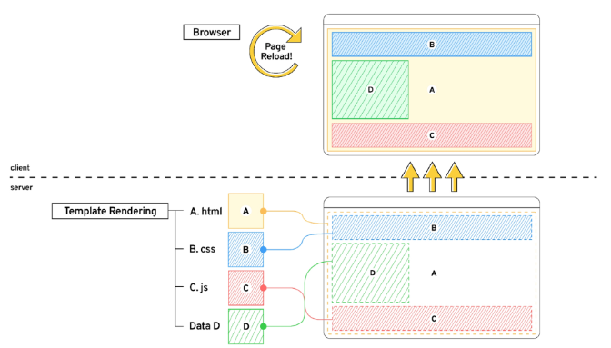
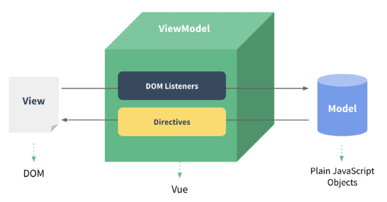

# Vue
- Vetur extension 설치
- Chrome Vue devtools extension 설치
## Front-end Development
- Front-end 개발은 Web App 또는 Web Site의 UI/UX를 제작하고 관리하느 ㄴ과정
- Front-end 프레임워크와 라이브러리(React, Angular, Vue,js)를 사용하여 개발 효율성을 높이고,  Web App의 복잡성을 관리
- Front-end 개발에 사용되는 주오 기술은 HTML, CSS, JavaScript
### Web App 이란?
- 웹 브라우저에서 실행되는 어플리케이션 소프트웨어
- 개발자 도구 -> 디바이스 모드
- 웹 페이지가 그대로 보이는 것이 아닌 디바이스에 설치된 App처럼 보이는 것
- 웹 페이지가 디바이스에 맞는 적절한 UX/UI로 표현되는 형태
### SPA (Single Page Application)
- Web App과 함께 자주 등장할 용어 SPA
- 이전까지는 사용자의 요청에 대해 적절한 페이지 별 template을 반환
- SPA는 서버에서 최초 1장의 HTML만 전달받아 모든 요청에 대응하는 방식
    - CSR (Client Side Rendering) 방식으로 요청을 처리하기 때문
> SSR (Server Side Rendering)
- 기존의 요청 처리 방식은 SSR
- Server가 사용자의 요청에 적합한 HTML을 렌더링하여 제공하는 방식
- 전달 받은 새 문서를 보여주기 위해 브라우저는 새로고침을 진행

### CSR (Client Side Rendering)
- 최초 한 장의 HTML을 받아오는 것은 동일
    - 단, server로부터 최초로 받아오는 문서는 빈 html 문서
```html
<body>
    <noscript>
        <strong>We're sorry but ...</strong>
    </noscript>
    <div id="app"></div>
    <!-- built files will be auto injected -->
</body>
```
- 각 요청에 대한 대응을 JavaScript를 사용하여 필요한 부분만 다시 렌더링
1. 필요한 페이지를 서버에 AJAX로 요청
2. 서버는 화면을 그리기 위해 필요한 데이터를 JSON 방식으로 전달
3. JSON 데이터를 JavaScript로 처리, DOM 트리에 반영(렌더링)
```javascript
axios.get(
    HOST_URL,
    {
        headers:{
            Authorization: 'Token ${key}'
        }
    }
)
.then(res => {
    this.todos = res.data
})
.catch(err => console.log(err))
```

### 왜 CSR 방식을 사용할까?
1. 모든 HTML 페이지를 서버로부터 받아서 표시하지 않아도 됨
    == 클라이언트 - 서버간 통신 즉, 트래픽 감소
    == 트래픽 감소 = 응답 속도가 빨라진다
2. 매번 새 문서를 받아 새로고침하는 것이 아니라 필요한 부분만 고쳐 나가므로 각 요청이 끊김없이 진행
    - SNS에서 추천을 누를 때 마다 첫 페이지로 돌아간다 = 끔찍한 App
    - 요청이 자연스럽게 진행된다 = UX 향상
3. BE와 FE의 작업 영역을 명확히 분리 할 수 있음
    - 각자 맡은 역할을 명확히 분리한다 = 협업이 용이해짐
### CSR은 만능일까?
- 첫 구동 시 필요한 데이터가 많으면 많을수록 최초 작동 시작까지 오랜 시간이 소요
- Naver, Netflix, Disney+ 등 모바일에 설치된 Web-App을 실행하게 되면 잠깐의 로딩 시간이 필요
- 검색 엔진 최적화(SEO, Search Engine Optimization)가 어려움
    - 서버가 제공하는 것은 텅 빈 HTML
    - 내용을 채우는 것은 AJAX 요청으로 얻은 JSON 데이터로 클라이언트(브라우저)가 진행
- 대체적으로 HTML에 작성된 내용을 기반으로 하는 검색 엔진에 빈 HTML을 공유하는 SPA 서비스가 노출되기는 어려움
### CSR vs SSR
- CSR과 SSR은 흑과 백이 아님
    - 내 서비스에 적합한 렌더링 방식을 적절하게 활용할 수 있어야 함
- SPA 서비스에서도 SSR을 지원하는 Framework가 발전하고 있음
    - Vue의 Nuxt.js
    - React의 Next.js
    - Angular Universal 등
### Front-end Framework
- Front-end Framework == HTML + CSS + JS 를 더 편하게 작업하기 위한 툴
    - React, Angular, Svelte, Vue 등
## Why Vue
- 쉽다
- 타 Framework에 비해 공식 문서가 잘 되있다
- HTML, CSS, JavaScirpt가 구분이 잘 되있다
### Vue의 기본 구조
- Vue의 구조는 매우 직관적
```vue
<template>
  <!-- HTML -->
    <div>
      <p>Hello</p>
    </div>
</template>

<script>
    // JavaScript
</script>

<style>
    /* CSS */
    p {
        colot: black;
    }
</style>
```
### Vue CDN
- Vue로 작업을 시작하기 위하여 CDN을 가져와야 함
- Django == Python Web Framework
    - pip install
- Vue == JS Front-end Framework
    - Bootstrap에서 사용했더 CDN 방식 사용
### Vue로 코드 작성하기
- 입력 받은 값을 name 뒤에 출력
    1. Vue CDN 가져오기
    2. Vue instance 생성
        - Vue instance - 1개의 Object
        - 미리 정해진 속성명을 가진 Object
    3. el, data 설정
        - data에 관리할 속성 정의
    4. 선언적 렌더링 {{}}
        - Vue data를 화면에 렌더링
    5. input tag에 v-model 작성
        - input에 값 입력 -> Vue data 반영
        - Vue data -> DOM 반영
```html
<body>
  <div id="app">
    <p id="name">name : {{ message }}</p>
    <input id="inputName" type="text" v-model="message">
  </div>
  
  <script src="https://cdn.jsdelivr.net/npm/vue@2/dist/vue.js"></script>
  <script>
    const app = new Vue({
      el: '#app',
      data: {
        message: '',
      }
    })
  </script>
</body>
```
### Facebook 예시
- 한 명의 유저가 이름을 변경한다면 화면에서 조작해야 할 영역이 매우 많음
- Vanilla JS만으로 모든 데이터를 조작한다면 불필요한 코드가 반복된다
- Vue를 통해 데이터를 관리한다면 변경 사항도 한 번에 반영된다
## Vue2 vs Vue3
### Vue3
- 2022년 02월 부터 Vue 프레임워크의 기본 버전이 3버전으로 전환
- 대체적인 설정들이 Vue3을 기본으로 적용되어 있음
    - 공식문서, CDN, npm 등
### Vue2
- 여전히 Vue2가 많이 사용됨
- 사용된 기간이 긴 만큼 상대적으로 많은 문서의 양, 참고자료, 질문/답변
## Vue instance
### MVVM Pattern
- 소프트웨어 아키텍처 패턴의 일종
- 마크업 언어로 구현하는 그래픽 사용자 인터페이스(view)의 개발을 Back-end(model)로부터 분리시켜 view가 어느 특정한 모델 플랫폼에 종속되지 않도록 함

- View : 우리 눈에 보이는 부분 = DOM
- Model : 실제 제이터 = JSON
- View Model (Vue)
    - View를 위한 Model
    - View와 연결(binding)되어 Action을 주고 받음
    - Model이 변경되면 View Model도 변경되고 바인딩된 View도 변경됨
    - View에서 사용자가 데이터를 변경하면 View Model의 데이터가 변경되고 바인딩된 다른 View도 변경됨
### MVVM Patter 정리
- MVC 패턴에서 Cotroller를 제외하고 View Model을 넣은 패턴
- View는 Model을 모르고, Model도 View를 모른다
    == DOM은 Data를 모른다, Data도 DOM을 모른다 (독립성 증가, 적은 의존성)
- View에서 데이터를 변경하면 View Model의 데이터가 변경되고, 연관된 다른 View도 함께 변경된다
### Vue instance
1. Vue CDN 가져오기
2. new 연산자를 사용한 생성자 함수 호출
    - vue instance 생성
3. 인스턴스 출력 및 확인
```html
<body>
  <script src="https://cdn.jsdelivr.net/npm/vue@2/dist/vue.js"></script>
  <script>
    const vm = new Vue()
    console.log(vm)
  </script>
</body>
```
- Vue instance === 1개의 객체
- 아주 많은 속성과 메서드를 이미 가지고 있고, 이러한 기능들을 사용하는 것
### el (element)
- Vue instance와 DOM을 mount(연결)하는 옵션
    - View와 Model을 연결하는 역할
    - HTML id 혹은 class와 마운트 가능
- Vue instance와 연결되지 않은 DOM 외부는 Vue의 영향을 받지 않음
    - Vue 속성 및 메서드 사용 불가
- 새로운 Vue instance 생성
- 생성자 함수 첫번째 인자로 Object 작성
- el 옵션에 #app 작성 = DOM 연결
- 인스턴스 출력
```html
<body>
  <div id="app">
    
  </div>
  <script src="https://cdn.jsdelivr.net/npm/vue@2/dist/vue.js"></script>
  <script>
    const vm = new Vue({
      el: '#app'
    })
    console.log(vm)
  </script>
</body>
```
### data
- Vue instance의 데이터 객체 혹은 인스턴스 속성
- 데이터 객체는 반드시 개본 객체 {}(object) 여야 함
- 객체 내부의 아이템들은 value로 모든 타입의 객체를 가질 수 있음
- 정의된 속성은 interpolation{{}}을 통해 view에 렌더링 가능함
- Vue instance에 data 객체 추가
- data 객체에 message 값 추가
- 결과 확인
- 추가된 객체의 각 값들은 this.message 형태로 접근 가능
```html
<body>
  <div id="app">
    <p>{{message}}</p>
  </div>
  <script src="https://cdn.jsdelivr.net/npm/vue@2/dist/vue.js"></script>
  <script>
    const app = new Vue({
      el: '#app',
      data: {
        message: 'Hello, Vue!',
      },
    })
    console.log(vm)
  </script>
```
### methods
- Vue instance의 method들을 정의하는 곳
- methods 객체 정의
    - 객체 내 print method 정의
    - print method 실행 시 Vue instance의 data내 message 출력
- 콘솔창에서 app.print() 실행
```html
<script>
  const app = new Vue({
    el: '#app',
    data: {
      message: 'Hello, Vue!',
    },
    methods: {
      print: function () {
        console.log(this.message)
      },
    },
  })
</script>
```
- method를 호출하여 data 변경 가능
    - 객체 내 bye method 정의
    - print method 실행 시 Vue instance의 data내 message 변경
- 콘솔창에서 app.bye() 실행
    - DOM에 바로 변경된 결과 반영
    - Vue의 강력한 반응성(reactivity)
```html
<script>
  const app = new Vue({
    el: '#app',
    data: {
      message: 'Hello, Vue!',
    },
    methods: {
      print: function () {
        console.log(this.message)
      },
      bye: function () {
        this.message = 'Bye, Vue!'
      },
    },
  })
</script>
```
### [주의] methods with Arrow Function
- 메서드를 정의 할 때, Arrow Function을 사용하면 안됨
- Arrow Function의 this는 함수가 선언될 때 상위 스코프를 가리킴
- 즉 this가 상위 객체 window를 가리킴
- 호출을 문제 없이 가능하나 this로 Vue의 data를 변경하지 못함
```html
<script>
  const app = new Vue({
    el: '#app',
    data: {
      message: 'Hello, Vue!',
    },
    methods: {
      print: function () {
        console.log(this.message)
      },
      bye: function () {
        this.message = 'Bye, Vue!'
      },
      arrowBye: () => {
        this.message = 'Arrow?'
        console.log(this)
      }
    },
  })
</script>
```