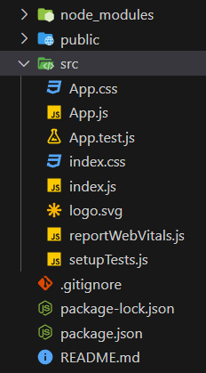

## node.js
- npm 명령어를 사용하기 위해 node.js 설치가 필요
- node.js를 사용하면 복잡한 react설치과정을 거치지 않고 아래와 같은 코드로 설치 가능하다
```
$ npx create-react-app [projectname]
```
- 최초 실행 시 설치 진행 여부를 확인하는데 y를 찍어주자
- 여기서 20%확률로 오류가 뜰 수 있는데 다양한 오류가 있어 검색이 필요
- 설치가 성공적으로 진행 됬다면 설치된 폴더에서 아래 코드로 샘플페이지를 실행할 수 있다
```
$ npm start
```
## 내부 파일

- src 폴더 내에서 코드 수정
- 샘플 코드 기준 App.js를 수정해 페이지를 수정할 수 있다