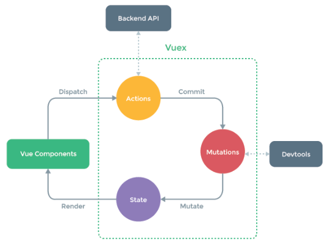

# Vue State Management
- State?
    - 현재에 대한 정보(data)
- 여러 개의 component를 조합해 하나의 App을 제작
- 각 componenet는 독립적이기 때문에 각각의 상태(data)를 가짐
- 여러 개의 component가 같은 상태(data)를 유지할 필요가 있음
## Pass Props & Emit Event
- props와 event를 이용해서 상태 관리를 진행
- 각 컴포넌트는 독립적으로 데이터를 관리
- 같은 데이터를 공유하고 있으므로 각 컴포넌트가 동일한 상태를 유지
- 데이터의 흐름을 직관적으로 파악 가능
- 하지만 컴포넌트의 중첩이 깊어지면 데이터 전달이 쉽지 않음

## Centralized Store
- 중앙 저장소(store)에 데이터를 모아서 상태 관리
- 각 component는 중앙 저장소의 데이터를 사용
- component의 계층에 상관없이 중앙 저장소에 접근해서 데이터를 얻거나 변경할 수 있음
- 중앙 저장소의 데이터가 변경되면 각각의 component는 해당 데이터의 변화에 반응하여 새로 변경된 데이터를 반영
- 규모가 크거나 컴포넌트 중첩이 깊은 프로젝트의 관리가 매우 편리

## Vuex
- "state Management Pattern + Library" for vue.js (상태 관리 패턴 + 라이브러리)
- 중앙 저장소를 통해 상태 관리를 할 수 있도록 하는 라이브러리
- 데이터가 예측 가능한 방식으로만 변경 될 수 있도록 하는 규칙을 설정하며, Vue의 반응성을 효율적으로 사용하는 상태 관리 기능을 제공
- Vue의 공식 도구로써 다양한 기능을 제공

# Vuex 시작하기
```
// Vue 프로젝트 생성
$ vue create vuex-app

// 디렉토리 이동
$ cd vuex-app

// Vue CLI를 통해 vuex plugin 적용
$ vue add vuex
```

## 프로젝트 with vuex
- src / store / index.js 가 생성됨
- vuex의 핵심 컨셉 4가지
    1. store
    2. getters
    3. mutations
    4. actions
```javascript
// index.js

import Vue from 'vue'
import Vuex from 'vuex'

Vue.use(Vuex)

export default new Vuex.Store({
  state: {
  },
  getters: {
  },
  mutations: {
  },
  actions: {
  },
  modules: {
  }
})
```
### 1. State
- vue 인스턴스의 data에 해당
- 중앙에서 관리하는 모든 상태 정보
- 개별 component는 state에서 데이터를 가져와서 사용
    - 개별 component가 관리하던 data를 중앙 저장소(Vuex Store의 state)에서 관리하게 됨
- state의 데이터가 변화하면 해당 데이터를 사용(공유)하는 component도 자동으로 다시 렌더링
- $store.state로 state데이터에 접근
### 2. Mutations
- 실제로 state를 변경하는 유일한 방법
- vue 인스턴스의 methods에 해당하지만 Mutations에서 호출되는 핸들러(handler) 함수는 반드시 동기적이어야 함
    - 비동기 로직으로 mutations를 사용해서 state를 변경하는 경우, state의 변화의 시기를 특정할 수 없기 때문
- 첫 번째 인자로 state를 받으며, component 혹은 Actions에서 commit() 메서드로 호출됨
- mutation, action에서 호출되는 함수를 handler 함수라고 함
### 3. Actions
- mutations와 비슷하지만 비동기 작업을 포함할 수 있다는 차이가 있음
- state를 직접 변경하지 않고 commit()메서드로 mutations를 호출해서 state를 변경함
- context 객체를 인자로 받으며, 이 객체를 통해 store.js의 모든 요소와 메서드에 접근할 수 있음 (즉, state를 직접 변경할 수 있지만 하지 않아야 함)
- component에서 dispatch() 메서드에 의해 호출됨
### Mutations & Actions
- vue component의 methods 역할이 vuex에서는 아래와 같이 분화됨
- Mutations
    - state를 변경
- Actions
    - state 변경을 제외한 나머지 로직


### 4. Getters
- vue 인스턴스의 computed에 해당
- state를 활용하여 계산된 값을 얻고자 할 때 사용
- state의 원본 데이터를 건들지 않고 계산된 값을 얻을 수 있음
- computed와 마찬가지로 getters의 결과는 캐시(cache) 되며, 종속된 값이 변경된 경우에만 재계산됨
- getters에서 계사된 값은 state에 영향을 미치지 않음
- 첫번째 인자로 state, 두번째 인자로 getter를 받음

### 모든 데이터를 Vuex에서 관리하나?
- Vuex를 사용한다고 해서 모든 데이터를 state에 넣어야 하는 것은 아님
- Vuex에서도 여전히 pass props, emit event를 사용하여 상태를 관리할 수 있음
- 개발 환경에 따라서 적절하게 사용하는 것이 필요함

### 정리
- state
    - 중앙에서 관리하는 모든 상태 정보
- mutations
    - state를 변경하기 위한 methods
- actions
    - 비동기 작업이 포함될 수 있는(외부 API와의 소통 등) methods
    - state를 변경하는 것 외의 모든 로직 진행
- getters
    - state를 활용해 계산한 새로운 변수 값
- component에서 데이터를 조작하기 위한 데이터의 흐름
    - component -> (actions) -> mutations -> state
- component에서 데이터를 사용하기 위한 데이터의 흐름
    - state -> (getters) -> component

## Vuex 실습
- 객체 축약형 사용
```javascript
// before
const obj1 = {
  addValue: function (value) {
    return value
  },
}

// after
const obj2 = {
  addValue(value) {
    return value
  },
}
```

### state
- 중앙에서 관리하는 모든 상태 정보
- $store.state로 접근 가능
- store의 state에 message 데이터 정의
```js
// index.js

import Vue from 'vue'
import Vuex from 'vuex'

Vue.use(Vuex)

export default new Vuex.Store({
  state: {
    message: 'message in store'
  },
  getters: {
  },
  mutations: {
  },
  actions: {
  },
  modules: {
  }
})
```
- component에서 state사용
```vue
// App.vue

<template>
  <div id="app">
    <h1>{{ $store.state.message }}</h1>
  </div>
</template>
```
- $store.state로 바로 접근하기 보다 computed에 정의 후 접근하는 것을 권장
```vue
<template>
  <div id="app">
    <h1>{{ message }}</h1>
  </div>
</template>

<script>
export default {
  name: 'App',
  components: {
  },
  computed: {
    message() {
      return this.$store.state.message
    }
  }
}
</script>
```
- Vue 개발자 도구에서 관리 화면을 Vuex로 변경 가능
- 관리 되고 있는 state 확인 가능

### actions
- state를 변경할 수 있는 mutations 호출
- component에서 dispatch()에 의해 호출됨
- dispatch(A, B)
    - A : 호출하고자 하는 actions 함수
    - B : 넘겨주는 데이터(payload)
- actions에 정의된 changeMessage함수에 데이터 전달하기
- component에서 actions는 dispatch()에 의해 호출됨

```vue
<template>
  <div id="app">
    <h1>{{ message }}</h1>
    <input type="text" @keyup.enter = "changeMessage" v-model="inputData">
  </div>
</template>

<script>
export default {
  name: 'App',
  data() {
    return {
      inputData: null,
    }
  },
  methods: {
    changeMessage() {
      const newMessage = this.inputData
      this.$store.dispatch('changeMessage', newMessage)
      this.inputData = null
    }
  },
  components: {
  },
  computed: {
    message() {
      return this.$store.state.message
    }
  }
}
</script>
```
- actions의 첫 번째 인자는 context
    - context는 store의 전반적인 속성을 모두 가지고 있으므로 context.state와 context.getters를 통해 mutations를 호출하는 것이 모두 가능
    - dispatch()를 사용해 다른 actions도 호출할 수 있음
    - 단, actions에서 state를 직접 조작하는 것은 삼가야 함
- actions의 두번째 인자는 payload
    - 넘겨준 데이터를 받아서 사용
```js
// index.js

export default new Vuex.Store({
  ...
  actions: {
    changeMessage(context, message) {
      console.log(context)
      console.log(message)
    }
  }
})
```
### mutations
- mutations는 state를 변경하는 유일한 방법
- component 또는 actions에서 commit()에 의해 호출
- commit(A, B)
    - A : 호출하고자 하는 mutations 함수
    - B : payload
```js
// index.js

export default new Vuex.Store({
  ...
  actions: {
    changeMessage(context, message) {
      context.commit('CHANGE_MESSAGE', message)
    }
  }
})
```
- mutations 함수
    - 첫 번째 인자는 state
    - 두 번째 인자는 payload
```js
// index.js

export default new Vuex.Store({
  ...
  mutations: {
    CHANGE_MESSAGE(state, message) {
      state.message = message
    }
  }
})
```
### getters
- getters는 state를 활용한 새로운 변수
- getters 함수
    - 첫 번째 인자는 state
    - 두 번째 인자는 getters
```js
// index.js

export default new Vuex.Store({
  ...
  getters: {
    messageLength(state) {
      return state.message.length
    },
    doubleLength(state, getters) {
      return getters.messageLength * 2
    }
  }
})
```
- getters 역시 state와 마찬가지로 computed에 정의해서 사용하는 것을 권장
```js
// App.vue

<template>
  <div id="app">
    <h1>{{ message }}의 길이는 {{ messageLength }}</h1>
    <h2>X2 : {{ doubleLength }}</h2>
    <input type="text" @keyup.enter = "changeMessage" v-model="inputData">
  </div>
</template>

<script>
export default {
  ...
  computed: {
    message() {
      return this.$store.state.message
    },
    messageLength() {
      return this.$store.getters.messageLength
    },
    doubleLength() {
      return this.$store.getters.doubleLength
    }
  }
}
</script>
```

> 그냥 mutations으로만 state를 변경하면 안되나?
- 가능하나, 저장소의 각 컨셉(state, getters, mutations, actions)은 각자의 역할이 존재하도록 설계 되어있음
- 물론 todo app처럼 actions의 로직이 특별한 작업 없이 단순히 mutations만을 호출하는 경우도 있으나, 이 경우는 Vuex 도입의 적절성을 판단해 볼 필요가 있음

> Vuex, 언제 사용하나?
- Vuex는 공유된 상태 관리를 처리하는데 유용하지만, 개념에 대한 이해와 시작하는 비용이 큼
- 애플리케이션이 단순하다면 Vuex가 없는 겂이 더 효율적일 수 있음
- 그러나 중대형 규모의 SPA를 구축하는 경우 Vuex는 자연스럽게 선택할 수 있는 단계가 오게 됨
- 결과적으로 역할에 적절한 상황에서 활용 했을 때 Vuex라이브러리 효용을 극대화 할 수 있음
- 필요한 순간이 왔을 때 사용하는 것을 권장