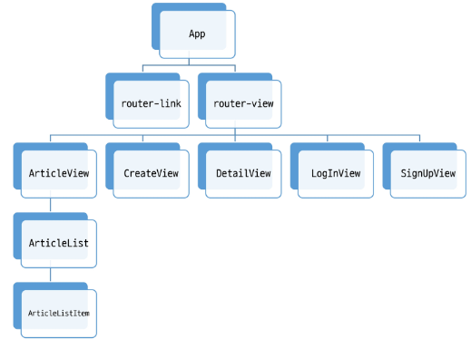
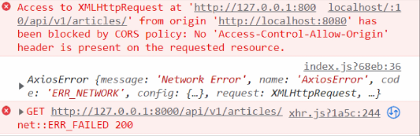
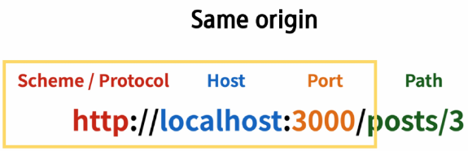

# Vue with DRF
## Server & Client
### Server
- 클라이언트에게 정보와 서비스를 제공하는 컴퓨터 시스템
- 서비스 전체를 제공 == Django Web Service
  - Django를 통해 전달받은 HTML에는 하나의 웹 페이지를 구성할 수 있는 모든 데이터가 포함됨
  - 즉, 서버에서 모든 내용을 렌더링해 하나의 HTML 파일로 제공
  - 정보를 포함한 web 서비스를 구성하는 모든 내용을 서버 측에서 제공
- 정보를 제공 == DRF API Service
  - Django를 통해 관리하는 정보만을 클라이언트에게 제공
  - DRF를 사용하여 JSON으로 변환
### Client
- Server가 제공하는 서비스에 적절한 요청을 통해 Server로부터 반환 받은 응답을 사용자에게 표현하는 기능을 가진 프로그램 혹은 시스템
- Server가 제공하는 서비스에 적절한 요청
  - Server가 정의한 방식대로 요청 인자를 넘겨 요청
  - Server는 정상적인 요청에 적합한 응답 제공
- Server로부터 반환 받은 응답을 사용자에게 표현
  - 사용자의 요청에 적합한 data를 server에 요청하여 응답 받은 결과로 적절한 화면을 구성
## DRF
### Skeleton code (Django)
- Model 구조
```python
from django.db import models
from django.conf import settings

# Create your models here.
class Article(models.Model):
    # user = models.ForeignKey(settings.AUTH_USER_MODEL, on_delete=models.CASCADE)
    title = models.CharField(max_length=100)
    content = models.TextField()
    created_at = models.DateTimeField(auto_now_add=True)
    updated_at = models.DateTimeField(auto_now=True)


class Comment(models.Model):
    article = models.ForeignKey(Article, on_delete=models.CASCADE)
    content = models.TextField()
    created_at = models.DateTimeField(auto_now_add=True)
    updated_at = models.DateTimeField(auto_now=True)
```
- url 경로
```python
# my_api/urls.py
from django.contrib import admin
from django.urls import path, include

urlpatterns = [
    path('admin/', admin.site.urls),
    path('api/v1/', include('articles.urls')),
]
```
```python
# articles/urls.py
from django.urls import path
from . import views

urlpatterns = [
    path('articles/', views.article_list),
    path('articles/<int:article_pk>/', views.article_detail),
    path('comments/', views.comment_list),
    path('comments/<int:comment_pk>/', views.comment_detail),
    path('articles/<int:article_pk>/comments/', views.comment_create),
]
```
- Dummy data 삽입
```
$ python manage.py migrate

$ python manage.py loaddata articles.json comments.json
```
- 서버 실행 후 전체 게시글 조회, 데이터 반환 확인
### Vue 컴포넌트 구조


### 메인 페이지 구성
- views/ArticleView.vue component 확인 및 route 등록
```vue
// src/views/ArticleView.vue

<template>
  <div>
    <h1>Article Page</h1>
  </div>
</template>

<script>
export default {
  name: 'ArticleView',
}
</script>

<style>

</style>
```
```js
// src/router/index.js

import Vue from 'vue'
import VueRouter from 'vue-router'
import ArticleView from '@/views/ArticleView'

Vue.use(VueRouter)

const routes = [
  {
    path: '/',
    name: 'ArticleView',
    component: ArticleView
  },
]
```
- src/App.vue router-link 연결 및 확인
```vue
// src/App.vue

<template>
  <div id="app">
    <nav>
      <router-link :to="{ name: 'ArticleView' }">Articles</router-link>
    </nav>
    <router-view/>
  </div>
</template>
```
- components/ArticleList.vue 확인
  - 전체 게시물을 표현할 컴포넌트
  - 화면 구성을 위한 최소한의 style 포함
```vue
// components/ArticleList.vue

<template>
  <div class="article-list">
    <h3>Article List</h3>
  </div>
</template>

<script>
export default {
  name: 'ArticleList',
}
</script>

<style>
.article-list {
  text-align: start;
}
</style>
```
- views/ArticleView.vue 추가 작성
- 'ArticleList' 하위 컴포넌트 등록
  1. 불러오기
  2. 등록하기
  3. 보여주기
```vue
// views/ArticleView.vue

<template>
  <div>
    <h1>Article Page</h1>
    <ArticleList/>
    <hr>
  </div>
</template>

<script>
import ArticleList from '@/components/ArticleList'

export default {
  name: 'ArticleView',
  components: {
    ArticleList,
  },
  computed:{
  },
}
</script>

<style>

</style>
```
- components/ArticleListItem.vue 작성
  - 각 게시글들의 정보를 표현할 컴포넌트
  - 데이터 없이 최소한의 기본 구조만 작성
```vue
// components/ArticleListItem.vue

<template>
  <div>
    <h5>PK</h5>
    <p>제목</p>
    <hr>
  </div>
</template>

<script>
export default {
  name: 'ArticleListItem',
}
</script>

<style>

</style>
```
- views/ArticleView.vue 추가 작성
```vue
// components/ArticleList.vue

<template>
  <div class="article-list">
    <h3>Article List</h3>
    <ArticleListItem/>
  </div>
</template>

<script>
import ArticleListItem from './ArticleListItem.vue';

export default {
  name: 'ArticleList',
  components: {
    ArticleListItem
  },
}
</script>

<style>
.article-list {
  text-align: start;
}
</style>
```
- store/index.js 작성
- state에 articles 배열 정의
- 화면 표현 체크용 데이터 생성
```js
export default new Vuex.Store({
  state: {
    articles: [
      {
        id:1,
        title: '제목',
        content: '내용',
      },
      {
        id:2,
        title: '제목2',
        content: '내용2',
      }
    ],
  },
})
```
- components/ArticleList.vue 코드 수정
  - state에서 articles 데이터 가져오기
  - v-for 디렉티브를 활용하여 하위 컴포넌트에서 사용할 article 단일 객체 정보를 pass props
```vue
// components/ArticleList.vue

<template>
  <div class="article-list">
    <h3>Article List</h3>
    <ArticleListItem v-for="article in articles" :key="article.id" :article="article" />
  </div>
</template>

<script>
import ArticleListItem from './ArticleListItem.vue';

export default {
  name: 'ArticleList',
  components: {
    ArticleListItem
  },
  computed: {
    articles() {
      return this.$store.state.articles
    }
  }
}
</script>

<style>
.article-list {
  text-align: start;
}
</style>

```
- components/ArticleListItem.vue 수정
  - 내려 받은 prop 데이터로 화면 구성
  - prop 데이터의 타입은 명확하게 표기
```vue
// components/ArticleListItem.vue

<template>
  <div>
    <h5>{{ article.id }}</h5>
    <p>{{ article.title }}</p>
    <hr>
  </div>
</template>

<script>
export default {
  name: 'ArticleListItem',
  props: {
    article: Object
  }
}
</script>

<style>

</style>
```
## Vue with DRF
### AJAX 요청 준비
- axios 설정
  - 설치
```
$ npm install axios
```
  - store/index.js 에서 불러오기
    - 요청 보낼 API server 도메인 변수에 담기
```js
// store/index.js

import axios from 'axios'

const API_URL = 'http://127.0.0.1:8000'
```
- store/index.js 추가 작성
  - 'getArticles' 메서드 정의
  - 요청 보낼 경로 확인 필수
  - 성공 시 .then
  - 실패 시 .catch
```js
// store/index.js

import Vue from 'vue'
import Vuex from 'vuex'
import axios from 'axios'

const API_URL = 'http://127.0.0.1:8000'
Vue.use(Vuex)

export default new Vuex.Store({
  state: {
    articles: [
    ],
  },
  getters: {
  },
  mutations: {
  },
  actions: {
    getArticles(context) {
      axios({
        method: 'get',
        url: `${API_URL}/api/v1/articles/`
      })
      .then((res) => {
        console.log(res, context)
      })
      .catch((err) => {
        console.log(err)
      })
    }
  },
  modules: {
  }
})

```
- views/ArticleView.vue 추가 작성
  - 'getArticles' actions 호출
  - 인스턴스가 생성된 직후 요청을 보내기 위해 created() hook 사용
```vue
// views/ArticleView.vue

<template>
  <div>
    <h1>Article Page</h1>
    <ArticleList/>
    <hr>
  </div>
</template>

<script>
import ArticleList from '@/components/ArticleList'

export default {
  name: 'ArticleView',
  components: {
    ArticleList,
  },
  computed:{
  },
  created() {
    this.getArticles()
  },
  methods: {
    getArticles() {
      this.$store.dispatch('getArticles')
    }
  }
}
</script>

<style>

</style>
```
### 요청 결과 확인
- Vue와 Django 서버를 모두 켠 후 메인 페이지 접속
- Server에서는 200을 반환하였으나 Client Console에서는 Error 발생

- CORS policy에 의해 block되어 데이터를 확인할 수 없다
# CORS
## Cross-Origin Resource Sharing
- 브라우저가 요청을 보냈고, 서버의 응답이 브라우저에 도착
  - Server log 상 200(정상) 반환
  - 서버의 응답은 정상이지만 브라우저가 막은 것
- 보안상의 이유로 브라우저는 **동일 출처 정책(SOP)**에 의해 다른 출처의 리소스와 상호작용하는 것을 제한 함
### SOP (Same-Origin Policy)
- 동일 출처 정책
- 불러온 문서나 스크립트가 다른 출처에서 가져온 리소스와 상호작용 하는 것을 제핞는 보안 방식
- 잠재적으로 해로울 수 있는 문서를 분리함으로써 공격받을 수 있는 경로를 줄임
### Oringin - "출처"
- URL의 Protocol, Host, Port를 모두 포함하여 출처라 부름
- 아래 세 영역이 일치하는 경우에만 동일 출처로 인정

### CORS - 교차 출처 리소스 공유
- 추가 **HTTP Header**를 사용하여, 특정 출처에서 실행 중인 웹 어플리케이션이 **다른 출처의 자원에 접근할 수 있는 권한**을 부여하도록 브라우저에 알려주는 체제
  - 어떤 출처에서 자신의 컨텐츠를 불러갈 수 있는지 **서버에 지정**할 수 있는 방법
- 리소스가 자신의 출처와 다를 때 교차 출처 HTTP 요청을 실행
  - 만약 다른 출처의 리소스를 가져오기 위해서는 이를 제공하는 서버가 브라우저에게 **다른 출처지만 접근해도 된다는 사실을 알려야 함**
  - "교차 출처 리소스 공유 정책 (CORS policy)"
### 교차 출처 리소스 공유 정책 (CORS policy)
- 다른 출처에서 온 리소스를 공유하는 것에 대한 정책
- CORS policy에 위배되는 경우 브라우저에서 해당 응답 결과를 사용하지 않음
  - Server에서 응답을 주더라도 브라우저에서 거절
- 다른 출처의 리소스를 불러오려면 그 출처에서 올바른 CORS header를 포함한 응답을 반환해야 함
## How to set CORS
- CORS 표준에 의해 추가된 HTTP Response Header를 통해 이를 통제 가능
- HTTP Response Header 예시
  - Access-Control-Allow-Origin / Access-Control-Allow-Credentials / Access-Control-Allow-Headers / Access-Control-Allow-Methods
- Access-Control-Allow-Origin
  - 단일 출처를 지정하여 브라우저가 해당 출처가 리소스에 접근하도록 허용
### Django-cors-headers library
- Django-cors-headers github 내용 확인
- 응답에 CORS header를 추가해주는 라이브러리
- 다른 출처에서 Django 애플리케이션에 대한 브라우저 내 요청을 허용
- 라이브러리 설치 및 requirements.txt 업데이트
```
$ pip install django-cors-headers

$ pip freeze > requirements.txt
```
- **App** 추가 및 **MIDDLEWARE** 추가
  - CorsMiddleware 는 가능한 CommonMiddleware 보다 먼저 정의 되어야 함
```python
# my_api/settings.py

INSTALLED_APPS = [
    ...
    "corsheaders",
    ...
]

MIDDLEWARE = [
    ...
    "corsheaders.middleware.CorsMiddleware",
    'django.middleware.common.CommonMiddleware',
    ...
]
```
- CORS_ALLOWED_ORIGINS 에서 교차 출처 자원공유를 허용할 도메인 등록
```python
# my_api/settings.py

CORS_ALLOWED_ORIGINS = [
    'http://localhost:8080',
]
```
- 만약 모든 Origin을 허용하고자 한다면
```python
# my_api/settings.py

CORS_ALLOWED_ALL_ORIGINS = True
```
### 결과 확인
- console 창에 정상적으로 출력되는 데이터 확인
- 응답에 Access-Control-Allow-Origin 헤더가 있는 것을 확인
# Vue with DRF (with CORS)
## Article Read
- 응답 받은 데이터 구조 확인
  - data Array 에 각 게시글 객체
  - 각 게시글 객체는 다음으로 구성
    1. id
    2. title
    3. content
- store/index.js 수정
  - 기존 articles 데이터 삭제
  - Mutations 정의
    - 응답 받아온 데이터를 state에 저장
```js
import Vue from 'vue'
import Vuex from 'vuex'
import axios from 'axios'

const API_URL = 'http://127.0.0.1:8000'
Vue.use(Vuex)

export default new Vuex.Store({
  state: {
    articles: [
    ],
  },
  getters: {
  },
  mutations: {
    GET_ARTICLES(state, articles) {
      state.articles = articles
    }
  },
  actions: {
    getArticles(context) {
      axios({
        method: 'get',
        url: `${API_URL}/api/v1/articles/`
      })
      .then((res) => {
        // console.log(res, context)
        context.commit('GET_ARTICLES', res.data)
      })
      .catch((err) => {
        console.log(err)
      })
    }
  },
  modules: {
  }
})
```
- 데이터 출력 확인
## Article Create
- views/CreateView.vue 작성
  - 게시글 생성을 위한 form 추가
  - v-model.trim 을 활용해 사용자 입력 데이터에서 공백 제거
  - .prevent를 활용해 form의 기본 이벤트 동작 막기
```vue
<template>
  <div>
    <h1>게시글 작성</h1>
    <form @submit.prevent="createArticle">
      <label for="title">제목 : </label>
      <input type="text" id="title" v-model.trim="title"><br>
      <label for="content">내용 : </label>
      <textarea id="content" cols="30" rows="10" v-model="content"></textarea><br>
      <input type="submit" id="submit">
    </form>
  </div>
</template>
```
- views/CreateView.vue script 작성
  - title, content가 비었다면 alert 을 통해 경고창 생성
  - AJAX 요청을 보내지 않도록 return 시켜 함수를 종료
  - axios를 사용해 server에 게시글 생성 요청
  - state를 변화 시키는 것이 아닌 DB에 게시글 생성 후, ArticleView로 이동할 것이므로 actions가 아닌 methods에서 직접 처리
```vue
<script>
import axios from 'axios'
const API_URL = 'http://127.0.0.1:8000'

export default {
  name: 'CreateView',
  data() {
    return {
        title: null,
        content: null,
    }
  },
  methods: {
    createArticle() {
      const title = this.title
      const content = this.content

      if (!title) {
        alert('제목을 입력해 주세요')
        return
      } else if (!content) {
        alert('내용을 입력해 주세요')
        return
      }
      axios({
        method: 'post',
        url:  `${API_URL}/api/v1/articles/`,
        data: {title, content},
      })
      .then((res) => {
        console.log(res)
      })
      .catch((err) => {
        console.log(err)
      })
    }
  }
}
</script>
```
- router/index.js 에 경로 추가
```js
import Vue from 'vue'
import VueRouter from 'vue-router'
import ArticleView from '@/views/ArticleView'
import CreateView from '@/views/CreateView'

Vue.use(VueRouter)

const routes = [
  {
    path: '/',
    name: 'ArticleView',
    component: ArticleView
  },
 
  {
    path: '/create',
    name: 'CreateView',
    component: CreateView
  },
]
```
- views/ArticleView.vue 추가 작성
  - router-link를 통해 CreateView로 이동
```vue
// views/ArticleView.vue

<template>
  <div>
    <h1>Article Page</h1>
    <router-link :to="{ name: 'CreateView' }">[Create Article]</router-link>
    <ArticleList/>
    <hr>
  </div>
</template>
```
- 게시글 작성 요청 결과 확인

- views/CreateView.vue 코드 수정
  - createArticle method 수정, 게시글 생성 완료 후 ArticleView로 이동
- 응답 확인을 위해 정의한 인자 res 제거
```vue
<script>
import axios from 'axios'
const API_URL = 'http://127.0.0.1:8000'

export default {
  ...
  methods: {
    createArticle() {
    ...
      axios({
        method: 'post',
        url:  `${API_URL}/api/v1/articles/`,
        data: {title, content},
      })
      .then(() => {
        this.$router.push({name: 'ArticleView'})
      })
      .catch((err) => {
        console.log(err)
      })
    }
  }
}
</script>
```

- 게시글 작성 요청 결과 재확인
  - 게시글 생성 후, ArticleView로 이동
  - 새로 생성된 게시글 확인 가능
- 어떻게 router로 이동만 했는데 보이나?
  - ArticleView가 create될 때 마다 server에 게시글 전체 데이터를 요청하고 있기 때문

> [참고] 지금의 요청 방식을 효율적인가?
- 비효율적 부분 존재
  - 전체 게시글 정보를 요청해야 새로 생성된 게시글을 확인 할 수 잇음
  - 만약 vuex state를 통해 전체 게시글 정보를 관리하도록 구성한다면 새롭게 생성한 게시글은 확인할 수 있다
  - 다만 자신 이외의 유저들이 새롭게 생성한 게시글을 언제 불어와야 하는지에 대한 기준이 애매하다
- 내가 구성하는 서비스에 따라 데이터 관리방식을 고려해야 한다

## Article Detail
- views/DetailView.vue 작성
  - 게시글 상세 정보를 표현할 컴포넌트
  - AJAX 요청으로 응답 받아올 article의 상세 정보들을 표현
```vue
// views/DetailView.vue

<template>
  <div>
    <h1>Detail</h1>
  </div>
</template>

<script>
export default {
  name: 'DetailView',
}
</script>
```
- router/index.js 경로 추가
  - id를 동적 인자로 입력 받아 특정 게시글에 대한 요청
- components/ArticleListItem.vue 추가 작성
  - router-link를 통해 특정 게시글의 id 값을 동적 인자로 전달
  - 게시글 상세 정보를 Server에 요청
```vue
// components/ArticleListItem.vue

<template>
  <div>
    <h5>{{ article.id }}</h5>
    <p>{{ article.title }}</p>
    <router-link :to="{
      name: 'DetailView', 
      params: {id:article.id}
      }">
      [DETAIL]
    </router-link>
    <hr>
  </div>
</template>

<script>
export default {
  name: 'ArticleListItem',
  props: {
    article: Object
  }
}
</script>

<style>

</style>
```
- views/DetailView.vue 추가 작성
  - this.$route.params를 활용해 컴포넌트가 create될 때, 넘겨받은 id로 상세 정보 AJAX 요청
```vue
<script>
import axios from 'axios'
const API_URL = 'http://127.0.0.1:8000'

export default {
  name: 'DetailView',
  created() {
    this.getArticleDetail()
  },
  methods: {
    getArticleDetail() {
      axios({
        method: 'get',
        url: `${API_URL}/api/v1/articles/${this.$route.params.id}/`,
      })
      .then((res) => {
        console.log(res)
        this.article = res.data
      })
      .catch((err) => {
        console.log(err)
      })
    }
  }
}
</script>
```
- 게시글 상세 정보 요청 결과 확인
  - 넘겨 받은 데이터 구조 확인 후, 적절하게 화면 구성
- views/DetailView.vue 수정
  - 응답 받은 정보를 data에 저장
  - data에 담기까지 시간이 걸리므로 optional chaining을 활용해 데이터 표기
```vue
// views/DetailView.vue

<template>
  <div>
    <h1>Detail</h1>
    <p>글 번호 : {{ article?.id }}</p>
    <p>제목 : {{ article?.title }}</p>
    <p>내용 : {{ article?.content }}</p>
    <p>작성시간 : {{ article?.created_at }}</p>
    <p>수정시간 : {{ article?.updated_at }}</p>
  </div>
</template>

<script>
import axios from 'axios'
const API_URL = 'http://127.0.0.1:8000'

export default {
  name: 'DetailView',
  data() {
    return {
      article: null
    }
  },
  created() {
    this.getArticleDetail()
  },
  methods: {
    getArticleDetail() {
      axios({
        method: 'get',
        url: `${API_URL}/api/v1/articles/${this.$route.params.id}/`,
      })
      .then((res) => {
        console.log(res)
        this.article = res.data
      })
      .catch((err) => {
        console.log(err)
      })
    }
  }
}
</script>
```